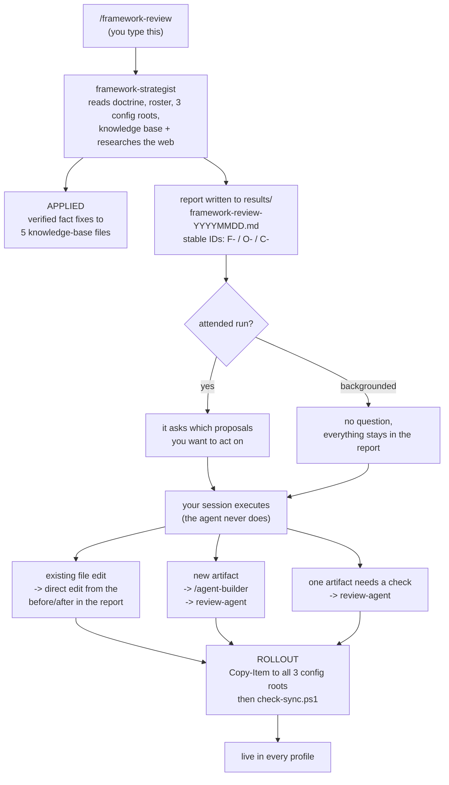

# Framework Review — how the loop actually works

What happens from the moment you type `/framework-review` to the moment a change is live in every config
root. Written for the human running it, not for the agent.

The short version: **the review decides *what*, you approve, your session does *how*.** The review itself
changes almost nothing. That is deliberate, and the reasons are in "Why it can't just do it" below.

Companion documents: `USAGE.md` (which entry point when), `UPDATING.md` (what's automatic vs. manual when
you change something staged here), `SETUP.md` (install and verify). The tool's own reference is
`..\skills\framework-review\SKILL.md`.

---

## The loop in one picture



---

## 1. Before your first run

One-time setup, **already done on this machine** as of 2026-09-05. Documented so it can be redone after a
rebuild or on another machine.

The agent carries no paths of its own. Everything comes from a scope file at the live config root, the
same indirection `req-estimator` uses for its rate card:

```powershell
$root = if ($env:CLAUDE_CONFIG_DIR) { $env:CLAUDE_CONFIG_DIR } else { "$env:USERPROFILE\.claude" }
New-Item -ItemType Directory -Force "$root\framework-data" | Out-Null
Copy-Item "D:\_AI_GIT\framework-data\scope.yaml.example" "$root\framework-data\scope.yaml"
```

Then edit it. Repeat for **all three** config roots and keep them identical — a review run under one
profile must see the same scope as a run under another. The fields that matter most are documented in the
template itself.

Without the file the agent still runs: it bootstraps what it can, reports what it could not resolve, and
offers to write the file from your answers on an attended run.

## 2. Running it

Run from **`D:\WORK\AI`**, under a profile (`claude-nsz`), not the default legacy root.

Why there: that folder has a `CLAUDE.md` pointing at the whole-system map, its `settings.json` already
allowlists the read-only tools this agent lives on, and both write targets (`results\`, `knowledge-base\`)
sit inside it. The working directory does **not** change what gets reviewed — scope comes entirely from
`scope.yaml` — so this is about ergonomics, not coverage.

| Command | Runs |
|---|---|
| `/framework-review` | Everything. The default, and what a periodic run means |
| `/framework-review drift` | Staged-vs-live sync across the three roots only |
| `/framework-review doctrine` | Doctrine integrity and roster coherence only |
| `/framework-review research` | Industry and platform delta only |
| `/framework-review ideas` | Opportunity brainstorm only |
| `/framework-review parity` | Copilot migration status only |

A full run is expensive: it reads the whole framework and fetches a pile of sources. Use a focused mode
when you already know what you're asking.

## 3. What comes back

A dated report at `D:\WORK\AI\results\framework-review-YYYYMMDD.md`, plus a summary in your session.

Everything carries a **stable ID**, which is the part that makes this workflow practical:

| Prefix | What it is |
|---|---|
| `F-NN` | Finding — something wrong, with evidence and impact |
| `O-NN` | Opportunity — a new place agentic work would pay off |
| `C-NN` | Changelist item — a specific action, in one of three buckets |

Because the IDs are stable and the report is a file, **you do not have to act in the same session.** You
can come back next week and say "do C-05" without re-running anything.

## 4. Deciding what to act on

Every recommendation lands in exactly one bucket. This split is the whole safety model:

| Bucket | Who acts | What it covers |
|---|---|---|
| **Applied** | The agent, already done | Verified factual corrections to five living knowledge-base files: a wrong count, a stale path, a candidate now adopted, a gap now closed. Only facts it checked against the filesystem that run |
| **Proposed** | You | Doctrine, agents, skills, commands, settings. Written as a concrete before/after so nobody re-derives it |
| **Build** | You, via `/agent-builder` | New artifacts. The report names what and in which layer; it drafts nothing |

On an attended run the agent asks which proposed items you want. **Saying yes there does not let it make
the edit.** Your picks come back as agreed next actions, and your session does the work in the open.

## 5. Executing each bucket

You typically just say *"do C-03 and C-07, and build O-02"*. Underneath, three different chains run:

### An edit to something that already exists

Doctrine file, agent, skill, command, settings. The session applies the before/after the report already
wrote. Bump the artifact's `> Version: X.Y.Z` line: patch for wording, minor for a new capability, major
for a structural rewrite.

Then **rollout** (section 6). Editing a staged file changes nothing live.

### A new agent, skill, or command

```
/agent-builder        -> drafts it per house conventions, in the layer the report named
review-agent          -> independent structural + doctrine check, returns a verdict
(fix any findings)
```

Then **rollout**. Do not skip `review-agent`: `agent-builder` self-checking its own work in the same
session is not independent, which is exactly the gap `agent-reviewer` was created to close.

**Watch the layer.** If the report routes an opportunity to the personal layer, it gets built into that
layer's own `.claude\`, never into `_AI_GIT` — `CONSTITUTION.md` Article IX, which names the exact
personal-layer path this rule applies to on this machine. The fact that a dev/work builder tool drafted it
does not make the output dev/work.

### One existing artifact needs a structural check

`review-agent` on that file. No rollout needed unless it changes something.

## 6. Making it live — the step that's easy to forget

**Nothing that touches behavior is live until it reaches all three config roots.** `CLAUDE_CONFIG_DIR`
fully redirects with no fallback, so a rollout that reaches one root leaves sessions under the others
silently running the old version. This has bitten this machine twice, in both directions.

Run the Copy-Item block from `..\claude\README.md` (Rollout, step 3), then verify:

```powershell
powershell -File D:\_AI_GIT\_scripts\check-sync.ps1
```

You want `All destinations fully in sync.` The `post-commit` hook runs this automatically and logs to
`_scripts\sync-check.log`, but it only **detects** drift; promotion stays a deliberate manual step.

Restart the session afterwards. A new skill has been observed registering mid-session, but do not rely on
it, and assume a restart is needed for a new agent.

Then, if you want it off the machine: `ai-backup` from a normal terminal, or
`powershell -File D:\WORK\AI\backup\ai-full-backup.ps1` from inside a session (`$PROFILE` isn't loaded in
Claude's own shells, so the bare `ai-backup` alias fails there).

## 7. Asking follow-up questions

The report is the start of the conversation. While the agent still holds the framework in context, reach
it with `SendMessage` to its agent id rather than re-dispatching — a new dispatch re-reads the whole
framework and re-fetches every source for nothing.

Worth asking: expand one finding, draft the exact before/after for a proposed change, argue against an
opportunity you think is wrong, or ask which single change would pay off most this month.

If the session is gone, the fallback is the report plus targeted `Grep` against the roots it names.

## 8. Cadence

Monthly is a reasonable start. The agent recommends its own next interval at the end of each report, based
on what it found.

Reports accumulate in `results\`, one per run, and are **meant to be compared**. The gap-register
reconciliation and the closing summary block exist so a later run can see what actually moved. Never
hand-edit an old report to reflect a later change — write the change into the framework and let the next
run observe it.

## 9. Why it can't just do it

The obvious question is why a tool that finds problems doesn't fix them. Three reasons that compound:

- **Blast radius.** It is the one tool that reads and reasons about the entire framework across three
  config roots. Something with that reach that could also rewrite doctrine autonomously is a bad trade.
- **Your own doctrine forbids it.** Articles II and VII require human approval for high-blast-radius and
  shared-state work; conduct baseline A4 forbids silent mutation without review. A tool built to police
  those rules cannot be the one artifact exempt from them.
- **Review independence.** New artifacts go through `/agent-builder` then `review-agent`, a real second
  pair of eyes. If the strategist drafted its own proposals, they would enter the framework through the
  one door with no review on it.

**Hard guarantees, enforced by the agent's own rules:** it never promotes to a config root, never touches
git state, never edits a doctrine or behavior file, never drafts an artifact, and never spawns a subagent.
Three of those are instruction-enforced rather than tool-enforced, because `Bash` is needed for the
sync-check script and `Edit` for the knowledge-base allowlist. The agent declares this trade-off in its own
rules, to the same standard it applies when auditing everything else.

If you later decide you want approved proposals applied directly, that is a small change to its rules.
Worth deciding once you have seen a few reports and know how good its proposals actually are — not before.

## 10. Worked example

```
D:\WORK\AI> /framework-review

  -> reads doctrine, roster, 3 config roots, knowledge base; fetches 11 sources
  -> APPLIED: corrected 2 stale entries in command-inventory.md
  -> report: results\framework-review-20260912.md
     F-01 high   dev-frontend missing from claude-scm profile
     F-04 medium 6 agents still missing the Version: line
     O-02 rank 1 recurring PR-comment triage across 3 repos -> generic agent
  -> asks: which proposals do you want to act on now?

You: fix F-01, and build O-02

  -> F-01: rollout Copy-Item to all three roots, then check-sync.ps1 -> in sync
  -> O-02: /agent-builder drafts pr-triage agent (generic, _AI_GIT)
           review-agent -> APPROVED WITH FIXES -> fixes applied
           rollout -> check-sync.ps1 -> in sync
  -> restart session; ai-backup

F-04 stays in the report. Do it next month, cite C-09.
```

---

**Added**: 2026-09-05, alongside `framework-strategist` v1.0.0 and `framework-review` v1.0.0. Written
because the post-report chain existed only as a single sentence in the skill, which left the most
important question — "it suggested something I want, now what?" — undocumented.
